# Deep Learning Applications — Laboratories

## Lab 1 — Convolutional Neural Networks

### Exercise 1.1 — A baseline MLP

An MLP classifies MNIST digits, the network is composed of two hidden layer, trained for 20 epochs.

<details>
<summary><b>MLP implementation</b></summary>

```python
class MLP(nn.Module):
    def __init__(self, input_dim=28 * 28, hidden_dim=64, depth=1, num_classes=10):
        super().__init__()
        layers = [nn.Flatten(), nn.Linear(input_dim, hidden_dim), nn.ReLU()]
        for _ in range(depth):
            layers += [nn.Linear(hidden_dim, hidden_dim), nn.ReLU()]
        layers.append(nn.Linear(hidden_dim, num_classes))
        self.net = nn.Sequential(*layers)

    def forward(self, x):
        return self.net(x)
```

</details>

| Training loss | Training accuracy |
|:---:|:---:|
| 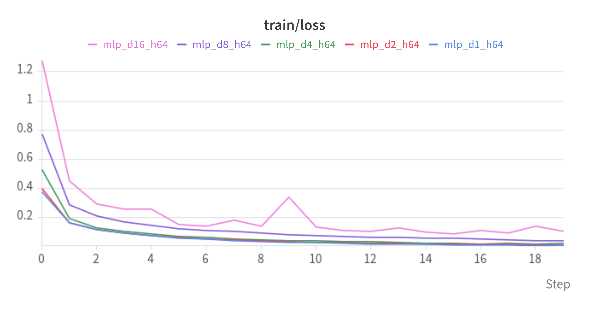 | 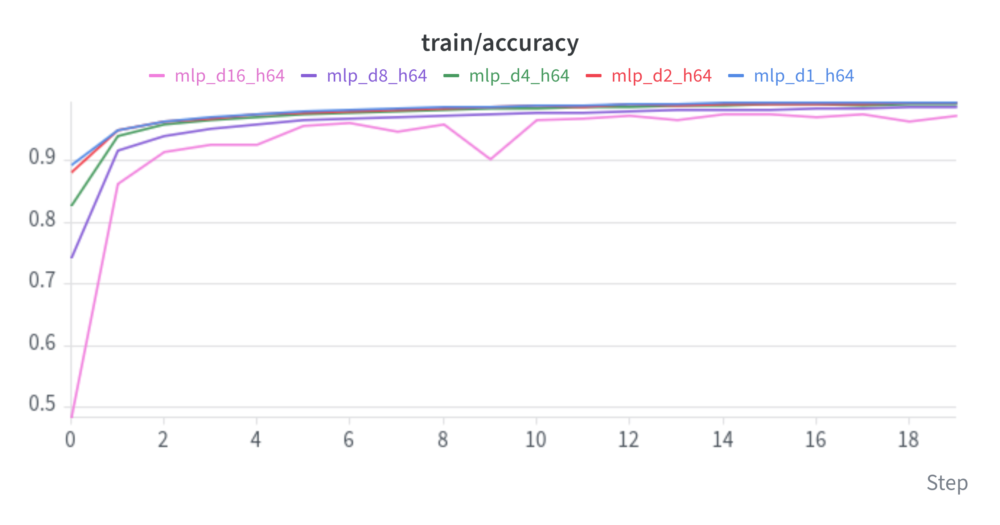 |
| **Validation loss** | **Validation accuracy** |
| 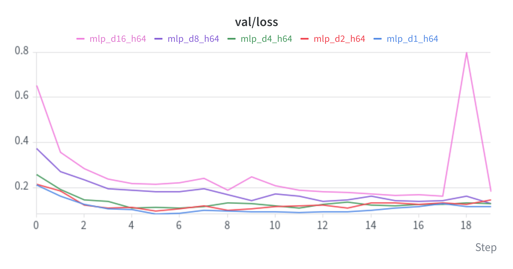 | 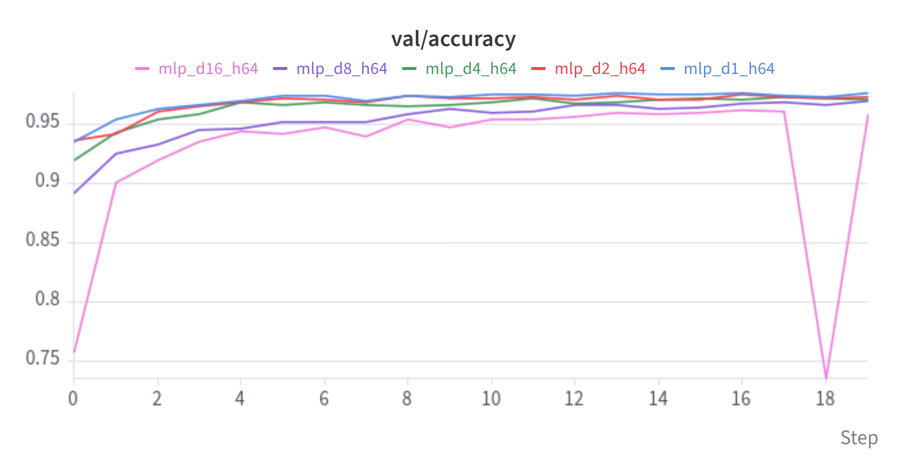 |

All networks converge within a few epochs. Depth does not help: the shallow networks reach about
97.5% validation accuracy, while the 16-layer one stays around 96% and trains less stably. Since the
deeper networks also have a higher training loss, deeper plain MLPs are
simply harder to optimize, which motivates residual connections.

### Exercise 1.2 — Adding Residual Connections

ResidualMLP groups the hidden layers into residual blocks. For the same depth the plain and residual networks have the same layers, the same number
of parameters and, with the same seed, identical initial weights: the skip connections are the only
difference.

<details>
<summary><b>ResidualMLP implementation</b></summary>

```python
class ResidualMLPBlock(nn.Module):
    def __init__(self, dim, num_layers=2):
        super().__init__()
        layers = []
        for i in range(num_layers):
            layers.append(nn.Linear(dim, dim))
            if i < num_layers - 1:
                layers.append(nn.ReLU())
        self.f = nn.Sequential(*layers)
        self.act = nn.ReLU()

    def forward(self, x):
        return self.act(x + self.f(x))


class ResidualMLP(nn.Module):
    def __init__(self, input_dim=28 * 28, hidden_dim=64, depth=2, num_classes=10, layers_per_block=2):
        super().__init__()
        layers = [nn.Flatten(), nn.Linear(input_dim, hidden_dim), nn.ReLU()]
        layers += [ResidualMLPBlock(hidden_dim, layers_per_block) for _ in range(depth // layers_per_block)]
        layers.append(nn.Linear(hidden_dim, num_classes))
        self.net = nn.Sequential(*layers)

    def forward(self, x):
        return self.net(x)
```

</details>

| | Training loss | Validation accuracy |
|:---:|:---:|:---:|
| **MLP** | 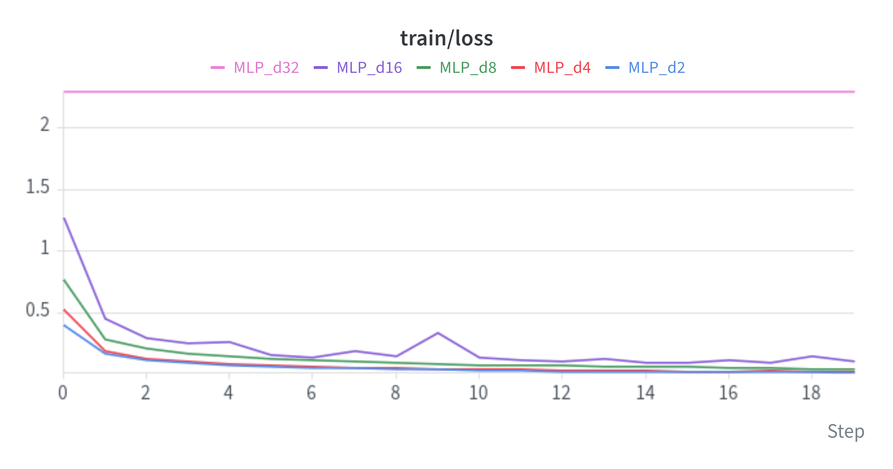 | 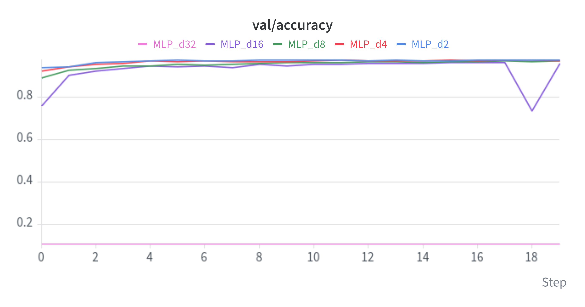 |
| **ResidualMLP** | 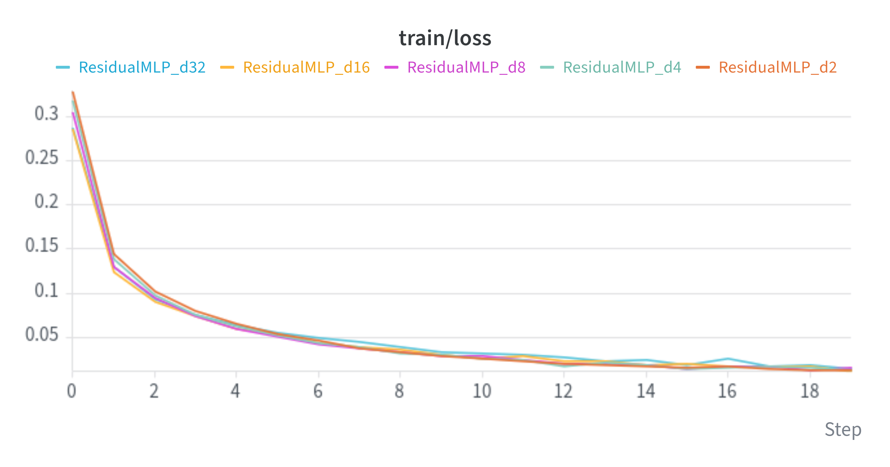 | 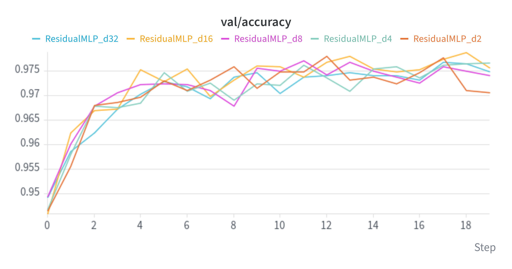 |

The plain MLP degrades with depth, and with 32 hidden layers it does not learn at all: its training
loss stays at $\approx 2.30$ and its accuracy at about 0.1. With residual
connections every depth trains equally well (above 99% training and 97–98% validation accuracy), so
a 32-layer residual MLP is as easy to train as a 2-layer one, confirming the ResNet result. On an easy
dataset like MNIST it also show that deep networks are not so usefull and a simple MLP make a good work too on a dataset like MNIST.

#### Extra — Gradient analysis

To understand why the deep plain MLP fails, we measure the gradient norm of each linear layer on a
single training batch, for every network, before and after training.

<details>
<summary><b>Gradient analysis code</b></summary>

```python
def grad_norms_per_layer(model, x, y):
    model.zero_grad()
    nn.functional.cross_entropy(model(x), y).backward()
    return [m.weight.grad.norm().item() for m in model.modules() if isinstance(m, nn.Linear)]


train_loader = get_mnist(batch_size=config_12["batch_size"], val_set_size=config_12["val_set_size"],
                         seed=config_12["seed"])[0]
x, y = (t.to(device) for t in next(iter(train_loader)))

grad_norms = {}
for trained_model, _, cfg in results_12.values():
    torch.manual_seed(cfg["seed"])
    init_model = MODELS[cfg["architecture"]](
        **{k: cfg[k] for k in ("hidden_dim", "depth", "layers_per_block") if k in cfg}).to(device)
    for stage, model in [("iniziale", init_model), ("post-training", trained_model)]:
        grad_norms[(cfg["architecture"], cfg["depth"], stage)] = grad_norms_per_layer(model, x, y)

ratios = pd.Series({k: norms[1] / norms[-2] for k, norms in grad_norms.items()}).unstack([2, 0])
```

</details>

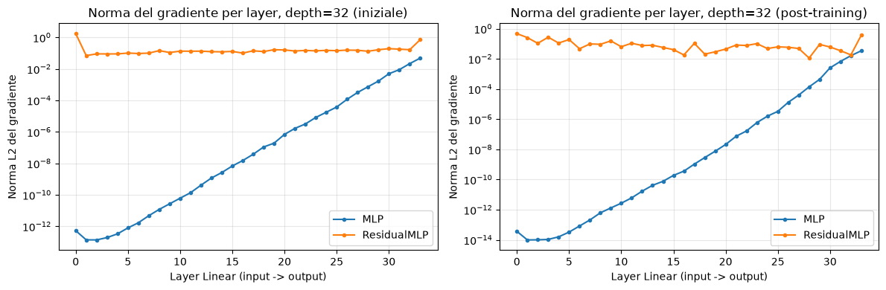

| Depth | MLP (initial) | MLP (trained) | ResidualMLP (initial) | ResidualMLP (trained) |
|:---:|:---:|:---:|:---:|:---:|
| 2  | 1.07 | 1.45 | 1.03 | 2.24 |
| 4  | 0.51 | 2.86 | 0.83 | 2.39 |
| 8  | 1.5 × 10⁻² | 5.02 | 0.67 | 2.35 |
| 16 | 1.6 × 10⁻⁵ | 5.79 | 0.64 | 5.81 |
| 32 | 6.4 × 10⁻¹² | 6.2 × 10⁻¹³ | 0.42 | 13.99 |

*Ratio between the gradient norm of the first and the last hidden layer*

The plain MLP suffers from vanishing gradients: the norm decays from the output to
the input by about 10 orders of magnitude with 32 layers.
In plain MLPs, the gradient is attenuated at every layer as it flows back towards the input: the deeper the network, the weaker it is when it reaches the first layers,
until it prevents them from being trained. In MLPs with skip connections, the gradient has a direct path through which it reaches the first layers without being attenuated, at any depth.

### Exercise 1.3 — Rinse and Repeat (but with a CNN)

The same comparison is repeated with CNNs on CIFAR-10. Both networks follow the CIFAR ResNet of the
original paper. The residual CNN uses torchvision's BasicBlock, the plain CNN uses PlainBlock, the same layers without the
skip connection. As before, both start from identical weights.

<details>
<summary><b>CNN implementation</b></summary>

```python
class PlainBlock(nn.Module):
    def __init__(self, inplanes, planes, stride=1, downsample=None):
        super().__init__()
        self.f = nn.Sequential(
            nn.Conv2d(inplanes, planes, 3, stride, 1, bias=False), nn.BatchNorm2d(planes), nn.ReLU(inplace=True),
            nn.Conv2d(planes, planes, 3, 1, 1, bias=False), nn.BatchNorm2d(planes), nn.ReLU(inplace=True),
        )

    def forward(self, x):
        return self.f(x)


class CIFARNet(nn.Module):
    def __init__(self, block, depth=1, base_channels=16, num_classes=10):
        super().__init__()
        c = base_channels
        self.stem = nn.Sequential(nn.Conv2d(3, c, 3, 1, 1, bias=False), nn.BatchNorm2d(c), nn.ReLU(inplace=True))
        layers, in_ch = [], c
        for out_ch, stride in [(c, 1), (2 * c, 2), (4 * c, 2)]:
            downsample = None if (stride == 1 and in_ch == out_ch) else nn.Sequential(
                nn.Conv2d(in_ch, out_ch, 1, stride, bias=False), nn.BatchNorm2d(out_ch))
            layers.append(block(in_ch, out_ch, stride, downsample))
            layers += [block(out_ch, out_ch) for _ in range(depth - 1)]
            in_ch = out_ch
        self.stages = nn.Sequential(*layers)
        self.fc = nn.Linear(4 * c, num_classes)

    def feature_maps(self, x):
        return self.stages(self.stem(x))

    def forward(self, x):
        return self.fc(self.feature_maps(x).mean(dim=(2, 3)))


MODELS["PlainCNN"] = lambda **kw: CIFARNet(PlainBlock, **kw)
MODELS["ResidualCNN"] = lambda **kw: CIFARNet(BasicBlock, **kw)
```

</details>

| | Training loss | Validation accuracy |
|:---:|:---:|:---:|
| **PlainCNN** | 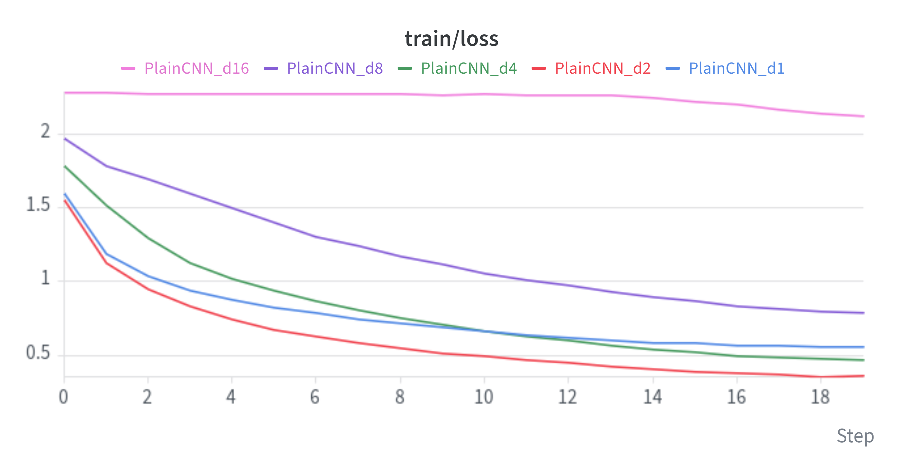 | 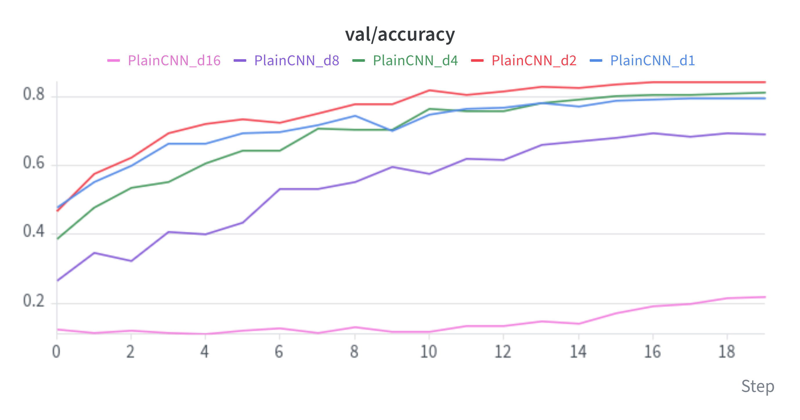 |
| **ResidualCNN** | 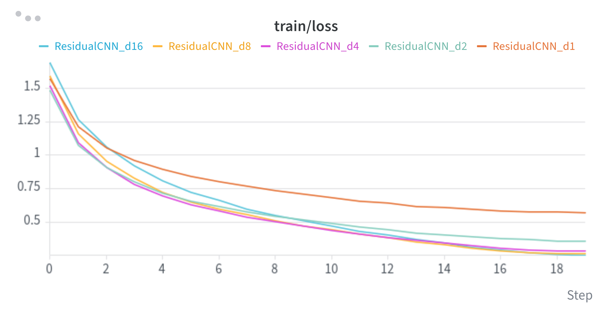 | 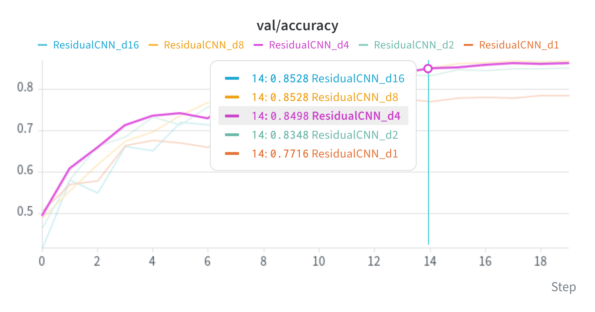 |

`d1` … `d16` correspond to 8, 14, 26, 50 and 98 layers.

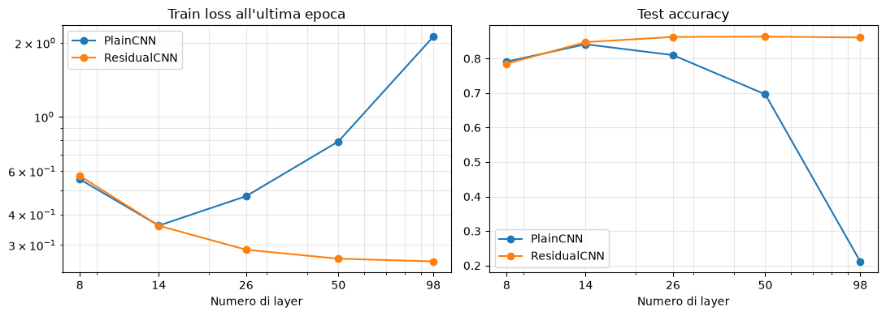

Deeper plain CNNs do not always work better: the best one has 14 layers (84% test accuracy),
then accuracy drops to 81%, 70% and 21% at 98 layers, with the training loss following the same
trend, the degradation problem again.
Even deeper residual CNNs do work better: accuracy grows with depth from 79% to about 86% and
the training loss keeps decreasing. Unlike MNIST, CIFAR-10 is hard enough for extra depth to be
useful, but only when the network can be trained.

### Exercise 2.3 — Explaining the predictions of a CNN

Using the best ResidualCNN from Exercise 1.3, the notebook implements CAM to visualize which image regions drive each classification decision, 
and compares it with a ResNet-18 pre-trained on ImageNet, applied to Imagenette.

<details>
<summary><b>CAM implementation</b></summary>

```python
def compute_cam(feature_fn, fc, images):
    with torch.no_grad():
        fmaps = feature_fn(images)
        preds = fc(fmaps.mean(dim=(2, 3))).argmax(dim=1)
        weights = fc.weight[preds]
        cams = torch.einsum("bkhw,bk->bhw", fmaps, weights).clamp(min=0)
        cams = cams - cams.amin(dim=(1, 2), keepdim=True)
        cams = cams / (cams.amax(dim=(1, 2), keepdim=True) + 1e-8)
        cams = nn.functional.interpolate(cams[:, None], size=images.shape[-2:],
                                         mode="bilinear", align_corners=False)
    return cams[:, 0].cpu(), preds.cpu()


cams, preds = compute_cam(cifar_model.feature_maps, cifar_model.fc, images)

resnet_trunk = nn.Sequential(*list(resnet.children())[:-2])
cams, preds = compute_cam(resnet_trunk, resnet.fc, images)
```

</details>

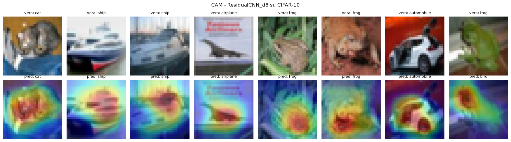

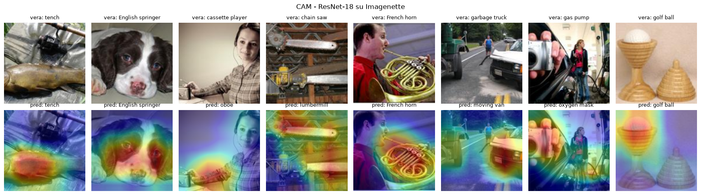

Both models attend to the objects rather than the background, the ResidualCNN produces maps centred on the cat, the ships, the frogs and even the airplane printed on a poster,
while the pre-trained ResNet-18 highlights the discriminative parts of each object

Both networks focus on the objects rather than the background: the cat, the ships, the airplane on
the poster, the body of the tench (not the hand), the face of the dog, the French horn. The maps
also explain the mistakes: the chain saw becomes a lumbermill because the network looks at the
whole woodworking scene, and the gas pump becomes an oxygen mask because it focuses on the hand
in the foreground.
