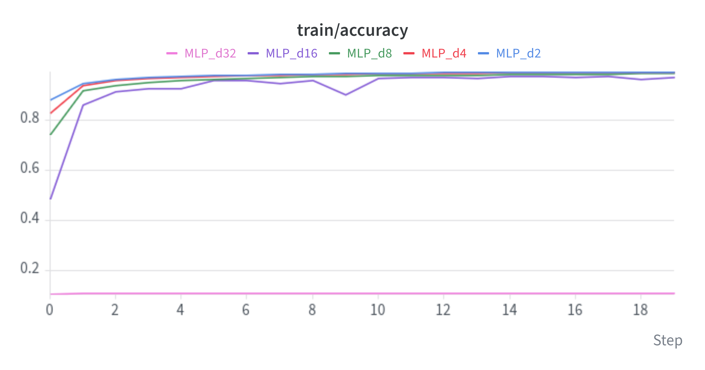
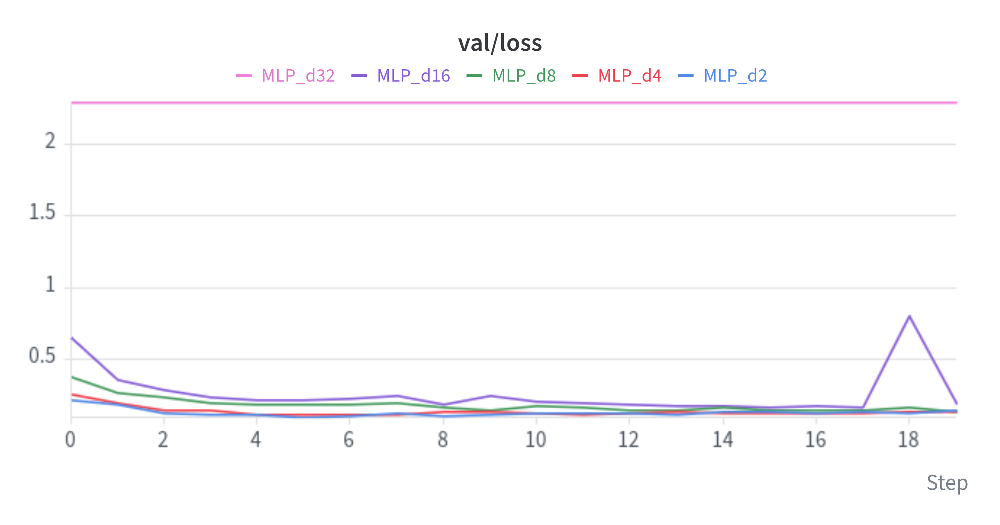
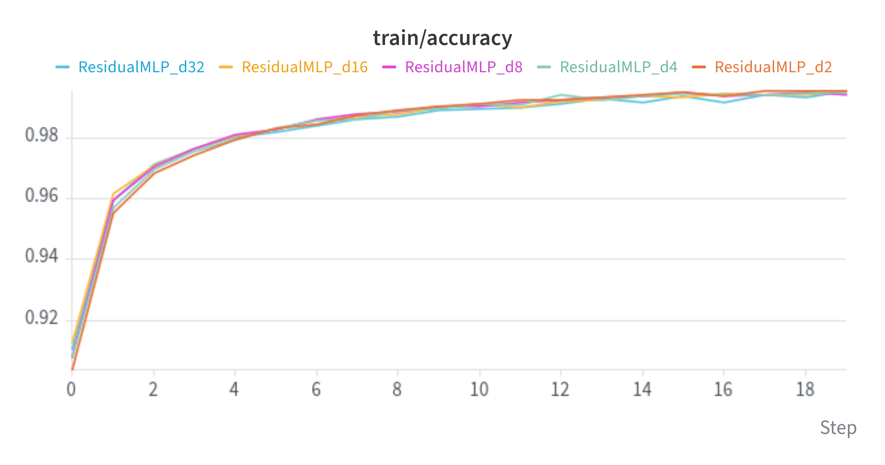
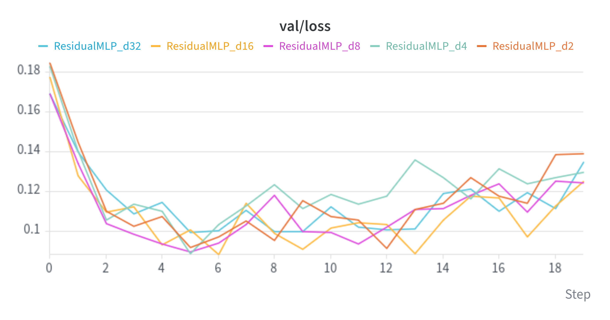
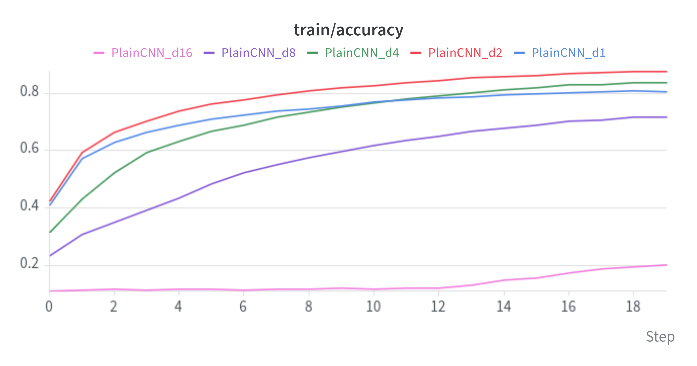
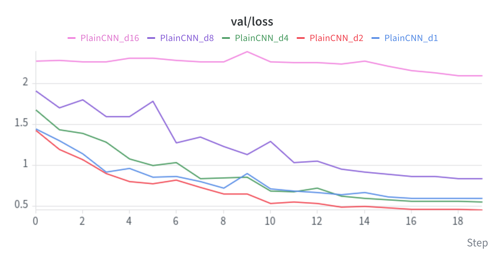
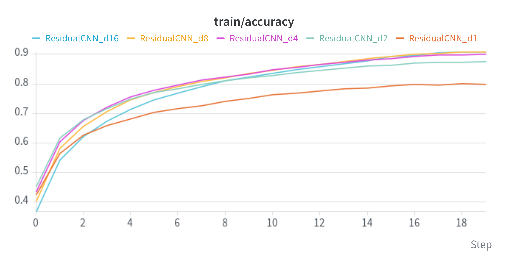
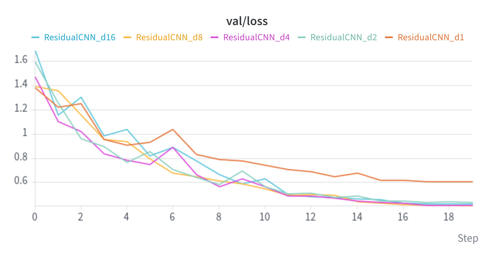

# Deep Learning Applications — Laboratories

## Lab 1 — Convolutional Neural Networks

### Exercise 1.1 — A baseline MLP

The goal of this exercise is to build a simple Multilayer Perceptron (MLP) to classify MNIST digits,
together with a reusable training pipeline that the following exercises build upon.

#### Architecture

Each 28×28 grayscale image is flattened into a 784-dimensional vector and processed by:

1. an **input projection**: a `Linear(784 → hidden_dim)` layer followed by a ReLU;
2. `depth` **hidden layers**, each a `Linear(hidden_dim → hidden_dim)` followed by a ReLU;
3. an **output layer** `Linear(hidden_dim → 10)` that produces the logits of the 10 classes.

The network does not apply a softmax at the end: `nn.CrossEntropyLoss` already combines log-softmax
and negative log-likelihood, so it expects raw logits.

With `depth=1` the network is the "two narrow layers" baseline requested by the exercise
(784 → 64 → 64 → 10). The `depth` parameter deliberately counts only the hidden → hidden layers,
excluding the input projection: this way the same definition can be reused for the residual network
of Exercise 1.2, where the input projection cannot have a skip connection because it changes the
dimensionality.

<details>
<summary><b>MLP implementation</b> (click to expand)</summary>

```python
class MLP(nn.Module):
    def __init__(self, input_dim=28 * 28, hidden_dim=64, depth=1, num_classes=10):
        super().__init__()
        layers = [nn.Flatten(), nn.Linear(input_dim, hidden_dim), nn.ReLU()]
        for _ in range(depth):
            layers += [nn.Linear(hidden_dim, hidden_dim), nn.ReLU()]
        layers.append(nn.Linear(hidden_dim, num_classes))
        self.net = nn.Sequential(*layers)

    def forward(self, x):
        return self.net(x)
```

</details>

#### Results

The plots below compare networks with `hidden_dim = 64` and increasing depth (1, 2, 4, 8 and 16
hidden layers).

| Training loss | Training accuracy |
|:---:|:---:|
|  |  |
| **Validation loss** | **Validation accuracy** |
|  |  |

All configurations converge quickly: most of the improvement in both loss and accuracy, on the
training and on the validation set, happens within the first two or three epochs, after which the
curves flatten out.

Increasing the depth does not help, and actually makes things slightly worse. The shallowest
networks (depth 1 and 2) reach the best validation accuracy, around 97.5%, while the deepest one
(depth 16) stays around 96%. The depth-16 network also starts from a much higher loss and trains
less stably, with sudden spikes in the training loss (epoch 9) and in the validation metrics
(epoch 18, where the validation accuracy temporarily drops to about 74% before recovering).

This confirms that MNIST is an easy task that a small MLP already solves well, so additional depth
brings no benefit. It is worth noting *why* the deeper networks perform worse: their **training**
loss is also higher, so the gap is not caused by overfitting. Deeper plain MLPs are simply harder to
optimize. This is the *degradation problem* that motivates residual connections, investigated in
Exercise 1.2.

For the shallow networks, the validation loss slowly creeps up in the last epochs while the training
loss keeps decreasing. This is a mild sign of overfitting; it does not affect the validation
accuracy, and since the weights of the epoch with the best validation accuracy are restored at the
end of training, it does not reach the final model.

### Exercise 1.2 — Adding Residual Connections

The goal of this exercise is to verify the main claim of the ResNet paper on MLPs: deeper plain
networks are harder to train, and residual connections fix this problem.

#### Architecture

The `ResidualMLP` keeps the same overall structure as the `MLP` of Exercise 1.1: an input projection
`Linear(784 → hidden_dim)` with ReLU, a stack of hidden layers, and an output layer
`Linear(hidden_dim → 10)`. The difference is how the `depth` hidden → hidden layers are organized:
they are grouped into **residual blocks** of `layers_per_block` layers each (2 in all experiments).

Each block computes

$$y = \text{ReLU}\big(x + F(x)\big)$$

where $F$ is the sequence `Linear → ReLU → Linear`. The last linear layer of $F$ is deliberately
**not** followed by a ReLU: the activation is applied only after the sum with the skip connection,
as in the original ResNet blocks. This way $F(x)$ can be either positive or negative, so each block
can both add to and subtract from its input. The input projection stays outside the blocks because
it changes the dimensionality (784 → `hidden_dim`), so its input cannot be summed to its output.

For a given `depth`, the plain and the residual networks therefore have **exactly the same layers
and the same number of parameters**. Moreover, since the layers are created in the same order, with
the same seed the two networks also start from **identical initial weights**: the skip connections
are the only difference between them.

<details>
<summary><b>ResidualMLP implementation</b> (click to expand)</summary>

```python
class ResidualMLPBlock(nn.Module):
    def __init__(self, dim, num_layers=2):
        super().__init__()
        layers = []
        for i in range(num_layers):
            layers.append(nn.Linear(dim, dim))
            if i < num_layers - 1:
                layers.append(nn.ReLU())
        self.f = nn.Sequential(*layers)
        self.act = nn.ReLU()

    def forward(self, x):
        return self.act(x + self.f(x))


class ResidualMLP(nn.Module):
    def __init__(self, input_dim=28 * 28, hidden_dim=64, depth=2, num_classes=10, layers_per_block=2):
        super().__init__()
        layers = [nn.Flatten(), nn.Linear(input_dim, hidden_dim), nn.ReLU()]
        layers += [ResidualMLPBlock(hidden_dim, layers_per_block) for _ in range(depth // layers_per_block)]
        layers.append(nn.Linear(hidden_dim, num_classes))
        self.net = nn.Sequential(*layers)

    def forward(self, x):
        return self.net(x)
```

</details>

#### Results

Both networks are trained with `hidden_dim = 64` and depth 2, 4, 8, 16 and 32 hidden layers.
Note that the y-axis ranges of the two sets of plots are different: the residual plots are zoomed in
on a much narrower range.

**Plain MLP**

| Training loss | Training accuracy |
|:---:|:---:|
|  |  |
| **Validation loss** | **Validation accuracy** |
|  |  |

**Residual MLP**

| Training loss | Training accuracy |
|:---:|:---:|
|  |  |
| **Validation loss** | **Validation accuracy** |
|  |  |

As already observed in Exercise 1.1, the plain MLP degrades as it gets deeper, and going up to
32 hidden layers makes this much more evident. Depths 2, 4 and 8 train without problems, depth 16
is slower and unstable, and depth 32 **does not learn at all**: its training loss stays flat at
about 2.30 for the whole training, which is $\ln 10$, the loss of a uniform prediction over the
10 classes, and its accuracy stays at about 11%, the level of a network that always predicts the
same class. Since the failure is on the training set itself, this is an optimization problem, not
overfitting: the network never moves away from its initialization.

With residual connections the problem disappears. All residual networks, including the one with
32 hidden layers, have practically overlapping training curves, reaching a training accuracy above
99% and a validation accuracy between 97% and 98%. A residual network with 32 hidden layers trains
as easily as one with 2, while the plain network of the same depth fails completely. This confirms
the main result of the ResNet paper: residual connections remove the degradation problem and make
deep networks trainable.

Two remarks complete the picture. First, on MNIST the deeper residual networks do not perform
*better* than the shallow ones: the task is easy enough that a shallow network already reaches the
attainable accuracy, so the benefit of the skip connections here is that depth stops *hurting*,
not that it starts *helping*. Second, the validation loss of the residual networks starts to rise
after about five epochs while the training loss keeps decreasing, a sign of overfitting; the
validation accuracy is not affected, and the weights of the best epoch are restored at the end of
training.

#### Gradient analysis

The previous results show *that* deep plain MLPs fail to train; this analysis explains *why*. For a
single training batch, the same for every network, we perform one forward and one backward pass
(without updating the weights) and measure the L2 norm of the gradient of the weights of each
linear layer. The analysis is repeated for every network of the sweep, both with the initial
weights (the exact same ones used at the beginning of training, thanks to the fixed seed) and with
the weights obtained after training.

<details>
<summary><b>Gradient analysis code</b> (click to expand)</summary>

```python
def grad_norms_per_layer(model, x, y):
    model.zero_grad()
    nn.functional.cross_entropy(model(x), y).backward()
    return [m.weight.grad.norm().item() for m in model.modules() if isinstance(m, nn.Linear)]


# A single training batch, the same for every network
train_loader = get_mnist(batch_size=config_12["batch_size"], val_set_size=config_12["val_set_size"],
                         seed=config_12["seed"])[0]
x, y = (t.to(device) for t in next(iter(train_loader)))

# Every network of the sweep, with the initial weights and after training
grad_norms = {}
for trained_model, _, cfg in results_12.values():
    torch.manual_seed(cfg["seed"])
    init_model = MODELS[cfg["architecture"]](
        **{k: cfg[k] for k in ("hidden_dim", "depth", "layers_per_block") if k in cfg}).to(device)
    for stage, model in [("iniziale", init_model), ("post-training", trained_model)]:
        grad_norms[(cfg["architecture"], cfg["depth"], stage)] = grad_norms_per_layer(model, x, y)

# Ratio between the first and the last hidden layer (both 64x64)
ratios = pd.Series({k: norms[1] / norms[-2] for k, norms in grad_norms.items()}).unstack([2, 0])
```

</details>

The plot shows the gradient norm of every linear layer, from the input projection (left) to the
output layer (right), for the two networks with 32 hidden layers. The y-axis is logarithmic.


The table summarizes all depths with a single number: the ratio between the gradient norm of the
first and of the last hidden layer. Both layers have the same shape (64×64), so their norms are
directly comparable. A value close to 1 means that the gradient reaches the first layers intact;
a value much smaller than 1 means that it vanishes on its way back.

| Depth | MLP (initial) | MLP (after training) | ResidualMLP (initial) | ResidualMLP (after training) |
|:---:|:---:|:---:|:---:|:---:|
| 2  | 1.07 | 1.45 | 1.03 | 2.24 |
| 4  | 0.51 | 2.86 | 0.83 | 2.39 |
| 8  | 1.5 × 10⁻² | 5.02 | 0.67 | 2.35 |
| 16 | 1.6 × 10⁻⁵ | 5.79 | 0.64 | 5.81 |
| 32 | 6.4 × 10⁻¹² | 6.2 × 10⁻¹³ | 0.42 | 13.99 |

**The plain MLP suffers from vanishing gradients.** At initialization, its gradient norm decreases
by roughly the same factor at every layer going from the output back to the input: on a log scale
the curve is a straight line, which means an exponential decay. With 32 hidden layers the first
layers receive a gradient about 12 orders of magnitude smaller than the last ones, around 10⁻¹³.
The table shows that this is a direct effect of depth: the ratio is about 1 with 2 hidden layers,
then drops to 10⁻², 10⁻⁵ and finally 10⁻¹² as the network gets deeper.

This decay is predicted by the theory. PyTorch initializes `nn.Linear` weights with variance
1/(3 · fan_in), smaller than the 2/fan_in that would preserve the signal through ReLU layers
(He initialization). Each layer therefore scales the variance of the backpropagated gradient by
about fan_in · 1/(3 · fan_in) · 1/2 = 1/6, the factor 1/2 coming from the ReLU that zeroes half of
the units. The norm is thus divided by about √6 ≈ 2.4 per layer, and over 32 layers by about
2.4³² ≈ 10¹², exactly the decay observed in the plot.

**The residual MLP does not.** Its gradient norm stays at the same order of magnitude across all
layers, and the ratio remains close to 1 at every depth. The reason is the skip connection: since
each block computes $y = \text{ReLU}(x + F(x))$, during the backward pass the gradient flows back
both through $F$ and directly through the identity path, so it is not repeatedly multiplied by
weight matrices that shrink it. Even when $F$ attenuates the signal, the identity path delivers a
useful gradient to the first layers.

**After training**, the picture explains the results of the previous section:

- The plain MLPs with 2 to 16 hidden layers, which did train, have ratios greater than 1: training
  moved the weights to a configuration where the gradient flows back without vanishing. Depth 16
  managed to get there even though its initial ratio was 10⁻⁵. A likely reason is that Adam
  normalizes each update by the running magnitude of its gradient, so even small gradients still
  produce meaningful updates.
- The plain MLP with 32 hidden layers is unchanged, with a ratio of 10⁻¹³. Its first layers receive
  gradients around 10⁻¹³, far below Adam's numerical stability constant ε = 10⁻⁸ added to that
  normalization: at this scale Adam can no longer amplify the updates, so the first layers
  effectively never move. The same 1/6 factor also shrinks the signal in the forward pass, so the
  last layers, which do receive a usable gradient, see an almost constant input and cannot learn
  anything beyond predicting the same output for every image. This is why the training loss stays
  flat at ln 10.
- The residual networks keep a healthy gradient flow at every depth. After training, the first
  layers even receive larger gradients than the last ones (ratios between 2 and 14), but the norms
  remain in a reasonable range (between 10⁻² and 1), with no sign of exploding gradients.

### Exercise 1.3 — Rinse and Repeat (but with a CNN)

The goal of this exercise is to repeat the verification of Exercise 1.2 with **Convolutional Neural
Networks** on **CIFAR-10**, a much harder dataset than MNIST: deeper CNNs without residual
connections should not always work better, while even deeper ones with residual connections should.

#### Architecture

Both networks follow the structure of the ResNet designed for CIFAR-10 in the original paper
(He et al., 2015):

1. a **stem**: a 3×3 convolution with 16 channels, followed by BatchNorm and ReLU;
2. three **stages** of `depth` blocks each, with 16, 32 and 64 channels and a spatial resolution of
   32×32, 16×16 and 8×8; the first block of the second and third stage halves the resolution with
   a stride of 2 and doubles the channels;
3. **Global Average Pooling** followed by a single `Linear(64 → 10)` layer.

Every block contains two 3×3 convolutions, so a network has 6 · `depth` + 2 layers with weights.
The experiments use `depth` ∈ {1, 2, 4, 8, 16}, i.e. networks with 8, 14, 26, 50 and 98 layers.

The two networks share the same skeleton, `CIFARNet`, and differ only in the block they use:

- the **residual CNN** uses the `BasicBlock` of `torchvision.models.resnet`, which computes
  conv → BN → ReLU → conv → BN, adds the input of the block through a skip connection and applies a
  final ReLU;
- the **plain CNN** uses `PlainBlock`, the same sequence of layers *without* the sum with the input.

When a block changes resolution or number of channels, the skip connection needs a projection
(a 1×1 convolution with stride 2 followed by BatchNorm) so that the input can be summed to the output.
The projection is created for the plain network as well, which simply ignores it: this way the layers
are created in the same order in both networks and, with the same seed, all the layers they have in
common start from **identical initial weights**. As in Exercise 1.2, the skip connections are the
only difference between the two networks.

<details>
<summary><b>CNN implementation</b> (click to expand)</summary>

```python
class PlainBlock(nn.Module):
    def __init__(self, inplanes, planes, stride=1, downsample=None):
        super().__init__()
        self.f = nn.Sequential(
            nn.Conv2d(inplanes, planes, 3, stride, 1, bias=False), nn.BatchNorm2d(planes), nn.ReLU(inplace=True),
            nn.Conv2d(planes, planes, 3, 1, 1, bias=False), nn.BatchNorm2d(planes), nn.ReLU(inplace=True),
        )

    def forward(self, x):
        return self.f(x)


class CIFARNet(nn.Module):
    def __init__(self, block, depth=1, base_channels=16, num_classes=10):
        super().__init__()
        c = base_channels
        self.stem = nn.Sequential(nn.Conv2d(3, c, 3, 1, 1, bias=False), nn.BatchNorm2d(c), nn.ReLU(inplace=True))
        layers, in_ch = [], c
        for out_ch, stride in [(c, 1), (2 * c, 2), (4 * c, 2)]:
            downsample = None if (stride == 1 and in_ch == out_ch) else nn.Sequential(
                nn.Conv2d(in_ch, out_ch, 1, stride, bias=False), nn.BatchNorm2d(out_ch))
            layers.append(block(in_ch, out_ch, stride, downsample))
            layers += [block(out_ch, out_ch) for _ in range(depth - 1)]
            in_ch = out_ch
        self.stages = nn.Sequential(*layers)
        self.fc = nn.Linear(4 * c, num_classes)

    def feature_maps(self, x):
        return self.stages(self.stem(x))

    def forward(self, x):
        return self.fc(self.feature_maps(x).mean(dim=(2, 3)))


MODELS["PlainCNN"] = lambda **kw: CIFARNet(PlainBlock, **kw)
MODELS["ResidualCNN"] = lambda **kw: CIFARNet(BasicBlock, **kw)
```

</details>

#### Results

In the legends, `d1`, `d2`, `d4`, `d8` and `d16` correspond to networks with 8, 14, 26, 50 and 98
layers.

**Plain CNN**

| Training loss | Training accuracy |
|:---:|:---:|
|  |  |
| **Validation loss** | **Validation accuracy** |
|  |  |

**Residual CNN**

| Training loss | Training accuracy |
|:---:|:---:|
|  |  |
| **Validation loss** | **Validation accuracy** |
|  |  |

The plot below summarizes all depths: on the left the training loss at the last epoch (log scale),
on the right the test accuracy, measured on the weights of the epoch with the best validation
accuracy.


The results reproduce the behaviour observed with the MLPs, and this time they also show the second
half of the ResNet claim.

**Deeper plain CNNs do not always work better.** Going from 8 to 14 layers helps: the 14-layer
network is the best plain CNN, with a validation accuracy of about 84%. Beyond that, adding layers
makes things worse: about 81% with 26 layers, 69% with 50 layers and only 22% with 98 layers. The
98-layer network barely learns: its training loss stays close to ln 10 ≈ 2.30 for the first twelve
epochs and decreases only slightly afterwards. Once again the ranking is the same on the training
set, where the deeper networks have a clearly higher loss, so this is the *degradation problem*
and not overfitting.

This happens even though every convolution is followed by BatchNorm, which keeps the scale of the
activations under control at every layer. As already noted in the ResNet paper, normalization is
not enough to make very deep plain networks easy to optimize.

**Even deeper residual CNNs do work better.** With skip connections every network trains
successfully, and the accuracy now *increases* with depth: about 78% with 8 layers, 85% with 14,
and 86% with 26, 50 and 98 layers, with the 50- and 98-layer networks reaching the lowest training
loss. Unlike MNIST, CIFAR-10 is hard enough for the extra depth to be useful, but only when the
network can actually be trained.

Comparing the two networks at the same depth makes the effect of the skip connections evident:
with 8 layers they perform the same (about 79–80% for both), because such a shallow network is easy
to train anyway, while the gap grows with depth until, at 98 layers, the residual network reaches
about 86% and the plain one about 22%.

Finally, no network shows signs of overfitting: the validation loss keeps decreasing until the end
of training, helped by the data augmentation (random crops and horizontal flips) applied to the
training set. The curves flatten in the last epochs because the learning rate follows a cosine
schedule that brings it close to zero at the end of training.

### Exercise 2.3 — Explaining the predictions of a CNN

The goal of this exercise is to use **Class Activation Maps** (CAM, Zhou et al., 2016) to see *where*
in an image a CNN looks when it recognizes a specific class. The method is applied both to the best
residual CNN trained on CIFAR-10 in Exercise 1.3 and to a ResNet-18 pre-trained on ImageNet, on
images from the Imagenette dataset.

#### The idea

CAM works for every network that ends with **Global Average Pooling followed by a single linear
layer**, as both the networks of Exercise 1.3 and ResNet-18 do. Let $A_k(x, y)$ be the activation of
channel $k$ of the last convolutional stage at position $(x, y)$, and $w_{c,k}$ the weight that the
linear layer assigns to channel $k$ for class $c$. The score of class $c$ is

$$s_c = \sum_k w_{c,k} \cdot \frac{1}{Z} \sum_{x,y} A_k(x,y) + b_c = \frac{1}{Z} \sum_{x,y} M_c(x,y) + b_c,
\qquad M_c(x,y) = \sum_k w_{c,k} \, A_k(x,y)$$

where $Z$ is the number of spatial positions. Since pooling and the linear layer are both linear,
their order can be swapped: the class score is exactly the average over the image of the map $M_c$,
plus the bias. $M_c$ is the class activation map: a spatial decomposition of the score, telling how
much each region of the image contributed to the decision for class $c$.

In practice, for each image:

1. the feature maps of the last stage are computed (64 maps of 8×8 for the CIFAR-10 network,
   512 maps of 7×7 for ResNet-18);
2. the maps are summed with the weights of the predicted class;
3. a ReLU keeps only the regions that contribute *in favour* of the class, and the map is
   normalized to [0, 1];
4. the map is upsampled to the resolution of the image with bilinear interpolation and overlaid on
   it as a heatmap.

No hooks are needed. The CIFAR-10 networks expose their last feature maps through the
`feature_maps` method, designed for this purpose in Exercise 1.3, while for ResNet-18 the same
result is obtained by keeping all its modules except the final pooling and linear layer. The
prediction is computed from the same feature maps (average + linear layer), so it is exactly the
prediction of the model and a single forward pass is enough.

<details>
<summary><b>CAM implementation</b> (click to expand)</summary>

```python
def compute_cam(feature_fn, fc, images):
    with torch.no_grad():
        fmaps = feature_fn(images)
        preds = fc(fmaps.mean(dim=(2, 3))).argmax(dim=1)
        weights = fc.weight[preds]
        cams = torch.einsum("bkhw,bk->bhw", fmaps, weights).clamp(min=0)
        cams = cams - cams.amin(dim=(1, 2), keepdim=True)
        cams = cams / (cams.amax(dim=(1, 2), keepdim=True) + 1e-8)
        cams = nn.functional.interpolate(cams[:, None], size=images.shape[-2:],
                                         mode="bilinear", align_corners=False)
    return cams[:, 0].cpu(), preds.cpu()


# CIFAR-10 network of Exercise 1.3
cams, preds = compute_cam(cifar_model.feature_maps, cifar_model.fc, images)

# Pre-trained ResNet-18: everything except avgpool and fc
resnet_trunk = nn.Sequential(*list(resnet.children())[:-2])
cams, preds = compute_cam(resnet_trunk, resnet.fc, images)
```

</details>

#### Results

In each figure the top row shows the images with their true label, the bottom row the CAM of the
predicted class (red = high contribution, blue = low contribution).

**Residual CNN trained on CIFAR-10.** The model is the residual CNN of Exercise 1.3 with the best
validation accuracy (50 layers, `ResidualCNN_d8`), applied to the first test images.


**ResNet-18 pre-trained on ImageNet**, applied to images from the Imagenette validation set at
160px, preprocessed with the official transforms of the pre-trained weights (resize preserving the
aspect ratio and center crop to 224×224).


#### Discussion

**The CIFAR-10 network looks at the objects.** Seven of the eight images are classified correctly,
and in all of them the map highlights the object rather than the background: the body of the cat,
the hulls of the ships, the silhouette of the airplane (even though it is printed on a poster), the
frogs and the car. The only mistake, a green frog classified as a bird, focuses on the upper-left
part of the animal, where its outline over a blurred background can resemble a perched bird.

**ResNet-18 localizes the discriminative parts.** For the correctly classified images the map is
centred on the evidence for the class: the body of the tench (and not the hand or the fishing rod),
the eyes and ears of the English springer, the French horn, the golf ball on top of the left cup.

**CAM also helps to understand the mistakes.** ResNet-18 predicts one of the 1000 ImageNet classes,
so it can choose classes that do not belong to Imagenette, and the maps show that its errors are
far from random:

- the *chain saw* is labelled as *lumbermill*, with the map on the blade and on the wooden structure
  around it: the model recognizes a woodworking scene;
- the *garbage truck* is labelled as *moving van*, with the map on the vehicle in the foreground:
  the model confuses two similar kinds of vehicles;
- the *cassette player* is labelled as *oboe*, with the map on the small object held in the hands
  of the woman: the network finds the right object, but a hand-held device close to the body is
  compatible with a wind instrument;
- the *gas pump* is labelled as *oxygen mask*, with the map on the hand holding a camera in the
  foreground, while the gas pump itself is mostly ignored.

In these cases the network looks at a plausible region of the image but interprets it differently,
or focuses on the most prominent object instead of the one that defines the label.

**The resolution of the maps is limited.** In both networks the map is computed on the last feature
maps, 8×8 and 7×7, and then upsampled, so it can only indicate the approximate region of the object,
not its precise contour. This is an intrinsic limitation of CAM: it trades spatial resolution for
the semantic information of the deepest layer.
